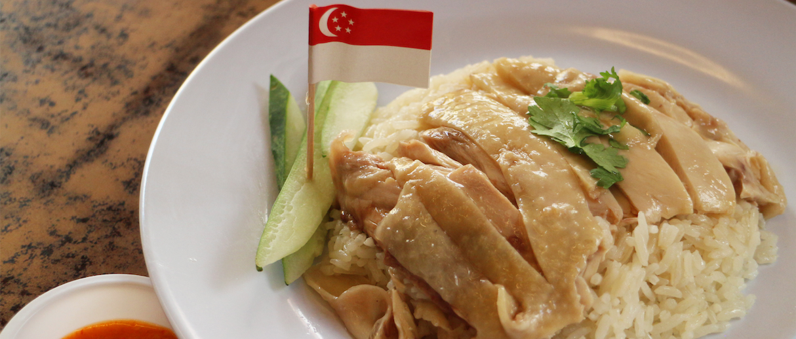
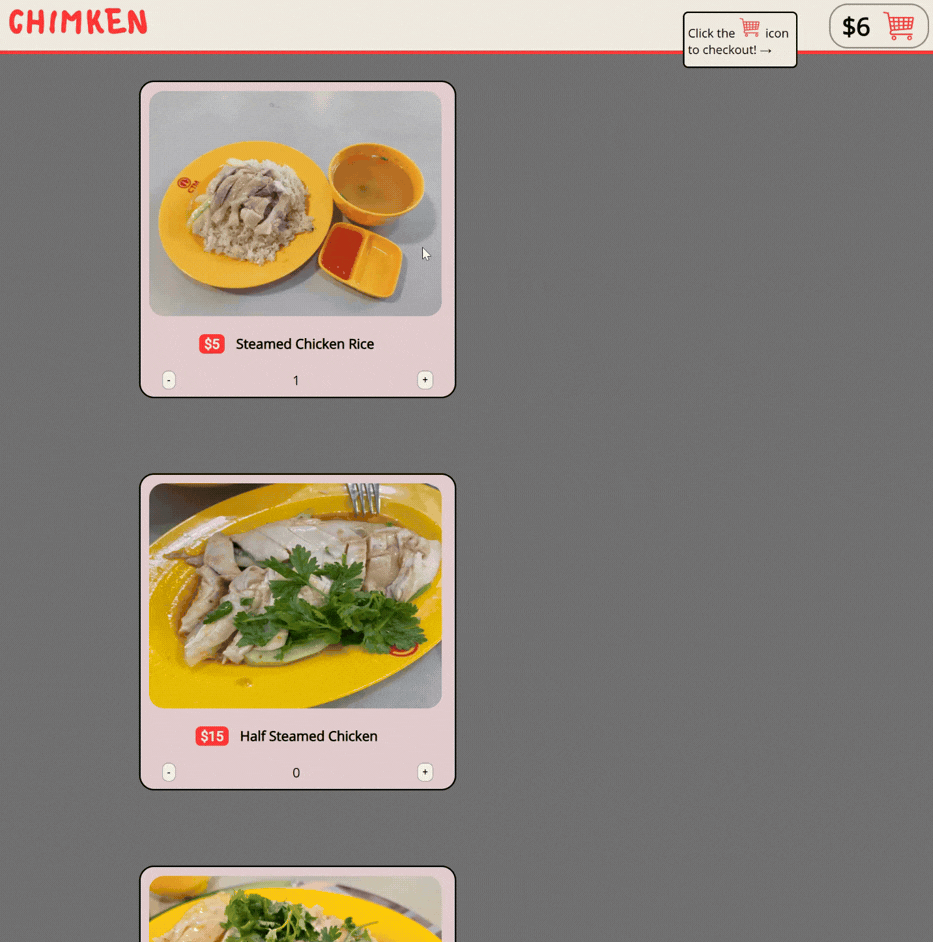
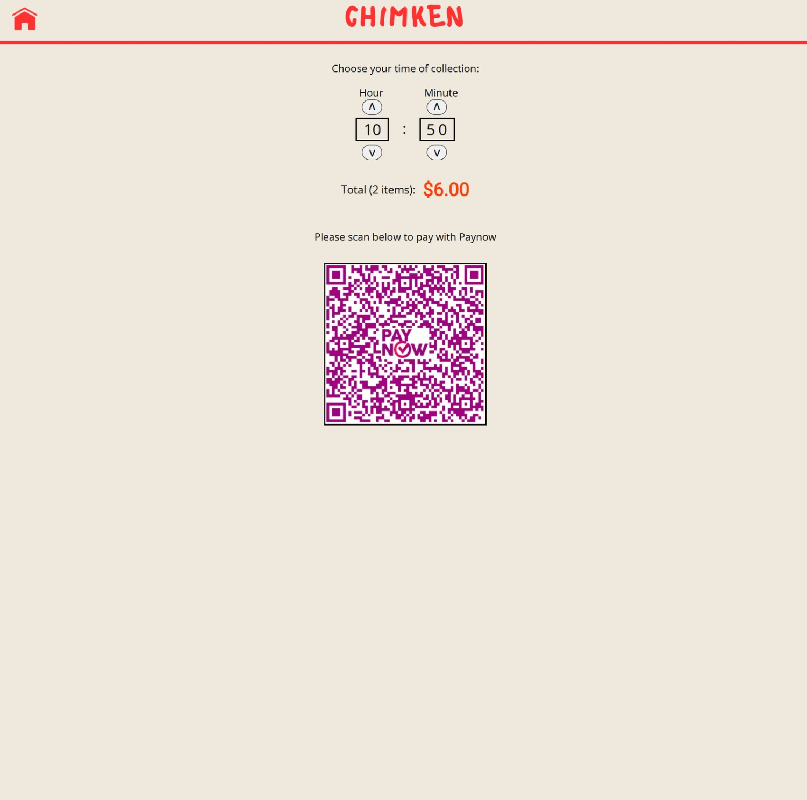
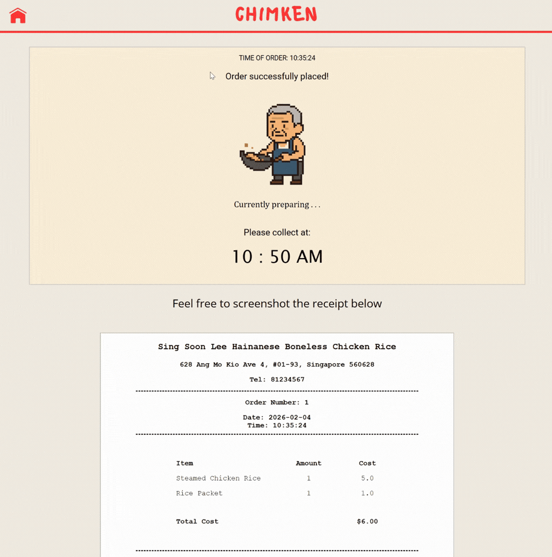

# Project-Chimken

- 🗪 Feel free to telegram me [@milkbottledude](https://t.me/milkbottledude) if you have any questions, or just want to chat :)

> TLDR: A poor man's online ordering system webapp :)
> 
[Webapp](https://xenon-height-425100-i6.et.r.appspot.com/) is now up! Care for some chicken rice?

## How to Use 🧐
### Step 1)
Select the quantity of each food you would like, as of now we offer 1) chicken rice, 2) half steamed chicken, 3) whole steamed chicken, and 4) rice packet, aka *jia fan*.

### Step 2)
Once done, press the red shopping cart symbol at the top right to check out. Check that the order is correct, then proceed to payment

### Step 3)
Choose the time you would like to collect your food by pressing the arrows to adjust the hour and minute. After that, scan and pay via the merchant QR code.

### Step 4)
Once payment is registered, you will get a digital receipt, as well as a reminder for the collection of your food.

### Step 5)
Enjoy your meal :)
